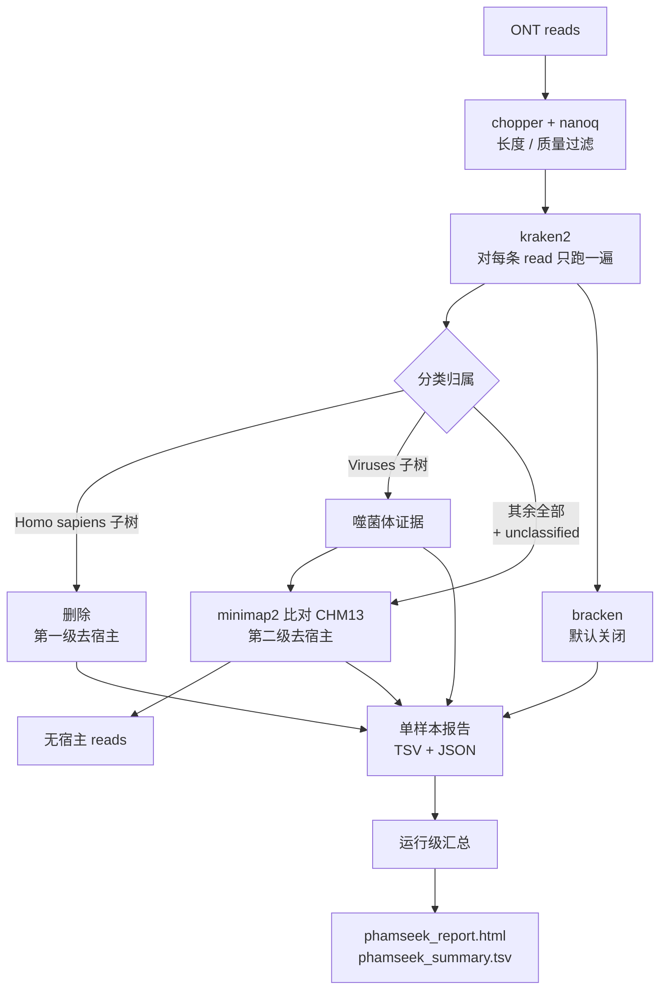

# phamseek

在低生物量临床样本的 Oxford Nanopore 宏基因组中检测噬菌体。

phamseek 读入血浆或脑脊液中已完成 basecalling 的 ONT reads,分两轮独立去除人源序列,
再拿剩下的 reads 对噬菌体参考库做分类。每次运行产出一份 HTML 报告和一份汇总 TSV,每个
样本另有一份 TSV 和一份 JSON。

> **不用于临床诊断(NOT FOR CLINICAL DIAGNOSIS)。** v0.1 只报告 read 级的 k-mer 证据。
> 每一个阳性都只是「候选」,必须由正交方法确认。

---

## 快速开始

```bash
bin/phamseek install                       # 一次性,不需要 root
bin/phamseek doctor                        # 检查工具与数据库是否可用

bin/phamseek run \
    --input samplesheet.csv \
    --db_dir /path/to/phamseek_db \
    --outdir results
```

报告落在 `results/summary/phamseek_report.html`。完整参数列表:`bin/phamseek run --help`。

你不需要知道 phamseek 底层是一条 Nextflow 流程,正常情况下也不需要自己去调 `nextflow`。

### Samplesheet

```csv
sample_id,fastq,platform,sample_type
plasma_01,reads/plasma_01.fastq.gz,ont,sample
csf_02,reads/csf_02.fastq.gz,ont,sample
ntc_01,reads/ntc_01.fastq.gz,ont,ntc
```

`fastq` 可以写绝对路径,也可以写相对于 samplesheet 自身目录的相对路径。`platform` 和
`sample_type` 可省略(默认 `ont` 和 `sample`)。

**只要有条件就放一个 no-template control。** 这类文库生物量极低,试剂污染是低丰度阳性的
主要来源。给了 `ntc` 行之后,phamseek 会把同时出现在对照里的每个 taxon 打上标记,并把已经
过线的那些下调判定等级。它不做对照扣减 —— 见 [docs/output.md](docs/output.md)。

---

## 它做了什么



**kraken2 跑在去宿主之前是刻意的。** 一遍分类把每条 read 都过完,这一遍既生成分类谱,又
顺带完成第一级去宿主,不额外花代价:当数据库带人源 decoy 序列时,约 99.6% 的人源 reads
会在一秒内落进 taxid 9606,留给比对器的工作量只剩一小部分。

**做两级,是因为一级不够。** kraken2 的 decoy 只改变 read 的「标签」,它不删掉任何东西。
数据库认不出来的 reads 照样会流进最终输出。第二级把第一级留下的所有 reads 比对
T2T-CHM13v2,只保留完全没有比对上的 —— 于是一条 read 只要碰到宿主参考就被删除,而不是
被换个标签。两级各自的去除数都写进报告。

两级互为冗余,而且这一点可以验证:用带 decoy 的库,第一级去掉 100% 的宿主 reads、第二级
什么也找不到;用不带 decoy 的库,第一级去掉 0%、第二级去掉 100%。两条路径给出同一个答案。

---

## 它刻意不做什么

| v0.1 不做 | 为什么 |
|---|---|
| 组装、geNomad、CheckV(`--mode full`) | 目标样本是低生物量的血浆和脑脊液,覆盖度通常撑不起组装。已验证的路线是 kraken2 先出线索、再做靶向 mapping。`--mode full` 直接报错并解释,而不是跑一条半成品路径。 |
| Illumina / paired-end 输入 | QC 步骤、minimap2 preset、单端 kraken2 调用全都是长读专用的。Illumina 数据跑出来的数字看着合理,其实不成立。 |
| 拆分嵌合 read | ONT cDNA 文库会产生 concatemer。v0.1 只「测量」由此产生的信号并报告出来,不拆分 reads。 |
| NTC 扣减 | 要定一条扣减规则需要重复对照,这次 pilot 没有。phamseek 改为打标记。 |
| 检出限标定 | 需要在真实检测体系上做梯度稀释。 |

---

## 参考数据库

数据库永远在本仓库之外,也永远不会被拷进 work 目录。`--db_dir` 期望的布局:

```
<db_dir>/kraken2/    kraken2 数据库(hash.k2d、opts.k2d、taxo.k2d)
<db_dir>/host/       第二级用的宿主参考(.mmi,或 FASTA)
```

kraken2 数据库的选择对整条流程影响最大。关键在于**它覆盖不覆盖目标生态位**,而不是它多大、
多快:0.9 GB 库和 11 GB 库之间,分类耗时只差约 14%,而对新颖序列的检出率相差 65 倍。真正的
硬约束只有内存,必须大于数据库体积 —— kraken2 是整库载入的。

强烈推荐用带非噬菌体 **decoy** 序列(细菌、质粒、人)的库。它把质粒假阳性从 37.4% 压到
0.4% 或更低,第一级去宿主也是靠它才能工作。

这一点不需要你手动声明。`--db_has_decoy auto`(默认)用 `kraken2-inspect` 读数据库自身的
taxonomy,分别报告人源、细菌、质粒三类 decoy,让报告里的假阳性提示跟着数据库的真实内容走。
传 `true` 或 `false` 可以覆盖。覆盖值与数据库矛盾时 —— 声明 `false` 却检出了任一类 decoy,
或声明 `true` 却三类一个都没检出 —— 报告会明说,而不是从错误前提往下推。

> 检测读的是**数据库**,绝不是某个样本的 kraken2 report。report 只列出拿到 reads 的 taxa,
> 所以一个带 decoy 的库在分析一个没有人源 reads 的样本时,report 里根本不会出现人源节点 ——
> 从 report 反推数据库内容,恰好会在去宿主最成功的那些样本上判错。

`.mmi` 宿主索引必须用与 mapping 时相同的 minimap2 preset(`map-ont`)构建;minimap2 会
静默地采用索引里的参数而不是命令行给的参数。

---

## 怎么读结果

读报告之前先读 [docs/output.md](docs/output.md)。最容易被漏掉的四个边界条件:

- **阴性结果不能排除噬菌体。** recall 取决于参考库里有没有近邻(≥80% ANI):有近邻时约 96%,
  没有时约 50%。
- **质粒与 ICE/IME 是假阳性的主要来源**,而且调高 `--kraken2_confidence` 解决不了。这个信号
  是真实的共享同源性(integrase、relaxase 模块),不是杂散 k-mer。解法是往库里加 decoy 序列。
- **RPM 是对非宿主 reads 归一化的**,这对人源占绝对主导的样本是正确做法,但当剩下的非宿主
  reads 很少时 RPM 会无上界地虚高。读 RPM 时必须同时看 `nonhost_denominator`。这个分母来自
  第一级(kraken2)之后的 reads 数,不扣除第二级比对再删掉的部分。
- **read 数不是独立分子数。** 这些文库都做过预扩增。

### 为什么 `--kraken2_confidence` 默认取 0.02


*左:在 ONT reads 上把 confidence 从 0.02 提到 0.10,read identity 为 95% 时 recall 掉 15 个
百分点、87% 时掉 29 个百分点 —— 而在 150 bp Illumina reads 上只掉 3.5 个百分点。短读数据上
「把这个阈值调紧」的做法不适用于这里。右:跨域嵌合 read 会被判给携带 k-mer 更多的那一段,
所以即便嵌合率高达 30%,也只有 0.70% 落到 root —— 这正是报告里的嵌合诊断被标注为非特异信号、
而不是嵌合率的原因。*

同域嵌合 read 的分类结果反而比纯 read 更好(92.7% vs 79.3%),因为它们更长。于是总体的
「病毒占比」几乎不动,底下的组成却已经变了 —— 只有把 reads 按真实来源分层才看得见这个效应。

这些方法和数字来自一项基于 kraken2 的噬菌体 in-silico 检测 benchmark,对应的模拟脚本见
`p0126-kraken2phage/scripts/ont_pilot.sh`。

---

## 文档

- [docs/usage.md](docs/usage.md) —— 常用参数、samplesheet 规则、实操示例
- [docs/output.md](docs/output.md) —— 输出布局、每一列的含义、怎么读一条判定
- [deploy/INSTALL.md](deploy/INSTALL.md) —— 安装,含离线主机

## 运行要求

- Linux,x86-64 或 arm64
- [pixi](https://pixi.sh)(单个静态二进制;不需要 root,也不碰已有的 conda 安装)
- 内存大于 kraken2 数据库体积(11 GB 的库约需 12 GB)
- 环境和 Nextflow 插件缓存好之后,运行期不需要联网

## 开发

```bash
nextflow run . -profile test,no_pixi -stub --outdir /tmp/phamseek_stub   # 只走接线
nextflow run . -profile test --db_dir <db> --outdir /tmp/phamseek_test   # 极小的真实运行
```

`test/` 里带了约 1.2 MB 模拟 ONT reads。它们来自一个刻意简化的模拟器
([test/make_test_data.py](test/make_test_data.py)),用途是检验流程接线和对一个近邻噬菌体的
检出。它们不是性能 benchmark。

## 许可

MIT —— 见 [LICENSE](LICENSE)。
