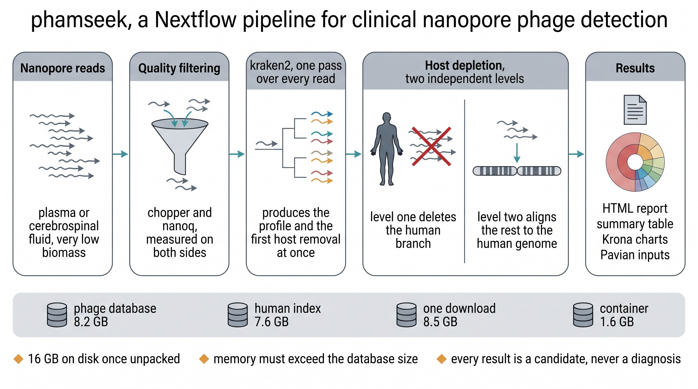
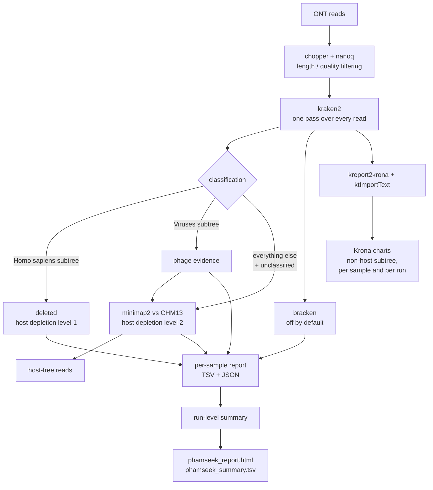
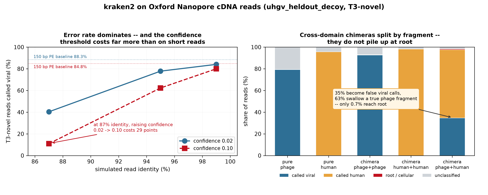

# nf-phamseek

**Phage detection in low-biomass clinical Oxford Nanopore metagenomes.**

[](https://www.nextflow.io/)
[](https://apptainer.org/)
[](https://www.docker.com/)
[](https://pixi.sh/)
[](https://github.com/rujinlong/nf-phamseek/actions/workflows/docker.yml)
[](https://hub.docker.com/r/jinlongru/nf-phamseek)
[](LICENSE)

> [!WARNING]
> **NOT FOR CLINICAL DIAGNOSIS.** phamseek reports read-level k-mer evidence only.
> Every positive is a *candidate* and has to be confirmed by an orthogonal method.

---

## Introduction

**nf-phamseek** takes basecalled Oxford Nanopore reads from plasma or cerebrospinal
fluid, removes human sequence in two independent passes, and classifies what remains
against a phage reference database. Each run produces one HTML report, one summary TSV
and one interactive Krona chart, plus a TSV, a JSON and a Krona chart per sample.

The pipeline is implemented in [Nextflow](https://www.nextflow.io) DSL2. Software comes
from a single multi-arch container image (`linux/amd64` and `linux/arm64`) built from a
committed [pixi.lock](pixi.lock), so the container, the pixi route and the offline bundle
all resolve to the same solved environment.

## Pipeline summary



*Reference data dominates the footprint — 16 GB on disk against a 1.6 GB image — which is why
it lives outside the container and versions on its own schedule. kraken2 sits ahead of host
depletion so a single pass yields both the taxonomic profile and the first level of removal.*



**kraken2 runs before host depletion on purpose.** One pass classifies every read, and
that single pass produces both the taxonomic profile and the first pass of host removal
at no extra cost: with a database that carries human decoy sequence, ~99.6% of human
reads land in taxid 9606 within a second, leaving only a small remainder for the aligner.

**Two levels, because one is not enough.** A kraken2 decoy only changes a read's *label*;
it deletes nothing. Reads the database does not recognise flow straight into the output.
Level 2 aligns everything level 1 left against T2T-CHM13v2 and keeps only reads with no
alignment at all — so a read is deleted the moment it touches the host reference, rather
than relabelled. Both levels report their own removal counts.

The two levels are redundant, and that is verifiable: with a decoy-carrying database
level 1 removes 100% of host reads and level 2 finds nothing; with a decoy-free database
level 1 removes 0% and level 2 removes 100%. Both paths give the same answer.

## Quick start

1. Install [Nextflow](https://www.nextflow.io/docs/latest/getstarted.html#installation)
   (`>=25.10.0`) and one of [Apptainer](https://apptainer.org/), Docker or
   [pixi](https://pixi.sh/).

2. Check the wiring without touching a database or a tool:

   ```bash
   nextflow run rujinlong/nf-phamseek -profile test,nocontainer -stub --outdir stub_results
   ```

3. Get the reference databases. **They are not in the image and not in this
   repository**, and nothing below runs without them:

   ```bash
   nextflow run rujinlong/nf-phamseek --mode setup --db_dir /data/phamseek_db
   ```

   ~8.5 GB downloaded, ~16 GB on disk once unpacked. Resumable, checksummed, idempotent
   (re-running skips what is already there), and it builds the directory layout the
   pipeline expects. Then run the bundled test data — the fastest end-to-end check:

   ```bash
   nextflow run rujinlong/nf-phamseek -profile test,apptainer \
       --db_dir /data/phamseek_db --outdir test_results
   ```

4. Run your own data:

   ```bash
   nextflow run rujinlong/nf-phamseek \
       -profile apptainer \
       --input samplesheet.csv \
       --db_dir /path/to/phamseek_db \
       --db_label inphared_decoy_2026-04 \
       --outdir results
   ```

   `-resume` continues an interrupted run instead of restarting it. `--help` prints every
   parameter with its default, and `--help <parameter>` prints the long entry for one of
   them; the same table is in [docs/usage.md](docs/usage.md#key-parameters).

The report lands in `results/summary/phamseek_report.html`, next to an interactive Krona
chart of every sample in `results/summary/phamseek_krona.html`.

## Samplesheet

A CSV with a header row:

```csv
sample_id,fastq,platform,sample_type
plasma_01,reads/plasma_01.fastq.gz,ont,sample
csf_02,/data/run17/csf_02.fastq.gz,ont,sample
ntc_01,reads/ntc_01.fastq.gz,ont,ntc
```

| Column | Required | Default | Notes |
|---|---|---|---|
| `sample_id` | yes | — | Unique, no whitespace. Becomes the output directory name. |
| `fastq` | yes | — | Absolute, or relative to the samplesheet's own directory. `.fastq`/`.fq`, optionally `.gz`. |
| `platform` | no | `ont` | Only `ont` is implemented. |
| `sample_type` | no | `sample` | One of `sample`, `ntc`, `positive_control`. |

Every row is validated before the pipeline starts: existence, readability, non-zero size,
plausible extension, and the gzip magic number for `.gz` files.

**Include a no-template control whenever you can.** These libraries are extremely low
biomass, and reagent contamination is the dominant source of low-abundance positives.
Given an `ntc` row, phamseek flags every taxon that also appears in the control and
downgrades those that had passed the reporting floor. It does not subtract the control —
see [docs/output.md](docs/output.md).

## Reference databases

Databases live **outside** this repository, outside the container image, and are never
copied into the work directory. `--db_dir` expects:

```
<db_dir>/kraken2/    kraken2 database (hash.k2d, opts.k2d, taxo.k2d)
<db_dir>/host/       host reference for level 2 (.mmi, or FASTA)
```

`--kraken2_db` and `--host_index` override either one individually.

`--mode setup` downloads a prebuilt pair in that layout — `inphared_decoy` (an
INPHARED-derived phage database carrying human, bacterial and plasmid decoy sequence) and a
`map-ont` minimap2 index of T2T-CHM13v2:

```bash
nextflow run rujinlong/nf-phamseek --mode setup --db_dir /data/phamseek_db
nextflow run rujinlong/nf-phamseek --mode setup --db_dir /data/phamseek_db --db_component host
```

It needs only `curl`, `tar` and `zstd` — the step runs outside the container on purpose, so
fetching a database does not first require pulling a 1.6 GB image. Downloads resume after an
interruption, every archive is checked against a pinned SHA-256 before it is unpacked, and
re-running skips whatever is already in place.

The same thing is available as a standalone script,
[deploy/fetch_db.sh](deploy/fetch_db.sh), for getting the databases onto a machine before
Nextflow is installed:

```bash
curl -fsSLO https://raw.githubusercontent.com/rujinlong/nf-phamseek/main/deploy/fetch_db.sh
bash fetch_db.sh --outdir /data/phamseek_db
```

Bring your own database instead whenever your target niche differs — that choice matters
more than anything else in the pipeline, for the reasons below.

The download is **never automatic**. A run that cannot find its database stops and prints
the exact `--mode setup` command to fix it, rather than starting an 8.5 GB transfer because
a path was mistyped, and rather than deciding on your behalf that `inphared_decoy` is the
right database for your samples.

The choice of kraken2 database matters more than anything else in the pipeline. What
matters is **whether it covers the target niche**, not how large or how fast it is:
between a 0.9 GB and an 11 GB database, classification time differs by ~14% while
detection of novel sequence differs 65-fold. The only hard constraint is memory, which
must exceed the database size — kraken2 loads it whole.

Use a database that carries non-phage **decoy** sequence (bacteria, plasmids, human). It
drops the plasmid false-positive rate from 37.4% to 0.4% or below, and level-1 host
depletion only works because of it.

You do not have to declare this. `--db_has_decoy auto` (the default) reads the database's
own taxonomy with `kraken2-inspect`, reports the human, bacterial and plasmid decoy
classes separately, and lets the report's false-positive wording follow what the database
actually contains. `true` or `false` override it; a declaration that contradicts the
database is stated as such rather than being reasoned from.

> Detection reads the **database**, never a sample's kraken2 report. A report lists only
> taxa that received reads, so a decoy-carrying database analysing a sample with no human
> reads shows no human node at all — inferring database content from a report gets it
> exactly backwards on the samples where host depletion worked best.

The `.mmi` host index must be built with the same minimap2 preset used for mapping
(`map-ont`); minimap2 silently honours the parameters stored in the index over those
given on the command line.

## Profiles

| Profile | Software comes from |
|---|---|
| *(none)* | **Apptainer** — the default. Pulls `docker.io/jinlongru/nf-phamseek:v0.2.0`. |
| `apptainer` | The same thing, stated explicitly. |
| `docker` | Docker, same image, running as your own uid/gid. |
| `singularity`, `podman` | Same image, other engines. |
| `pixi` | The locked conda environment in `.pixi/`, activated per task. Run `pixi install --frozen` first. |
| `nocontainer` | Whatever is already on `PATH` — a pre-activated shell, an HPC module system, or the offline bundle. |
| `test` | The simulated ONT reads in [test/](test/). Combine it with one of the above. |
| `slurm` | Submits to Slurm instead of running locally. |

`--mode setup` needs no profile: the download step declares no container and uses
`curl`, `tar` and `zstd` from the host.

Nextflow has no native pixi support: the `process.pixi` directive was proposed in
[nextflow-io/nextflow#6157](https://github.com/nextflow-io/nextflow/pull/6157), closed in
favour of a general `package` directive in
[#6342](https://github.com/nextflow-io/nextflow/pull/6342), and that was closed too in
February 2026. `-profile pixi` therefore activates the environment through
`beforeScript` + `pixi shell-hook`, which is also what picks up `LD_LIBRARY_PATH` and the
other activation variables that prepending `bin/` to `PATH` would miss.

Air-gapped installations have three further routes — a pixi-pack bundle, a self-contained
Apptainer image, and a preflight check that picks between them. See
[deploy/INSTALL.md](deploy/INSTALL.md).

## Reading the results

Read [docs/output.md](docs/output.md) before reading a report. The four boundary
conditions most easily missed:

- **A negative result does not exclude phage.** Recall depends on whether the reference
  database holds a ≥80% ANI neighbour: ~96% when it does, ~50% when it does not.
- **Plasmids and ICE/IME are the dominant false-positive source**, and raising
  `--kraken2_confidence` will not fix it. The signal is real shared homology (integrase,
  relaxase modules), not stray k-mers. The fix is decoy sequence in the database.
- **RPM is normalised over non-host reads.** That is the right denominator when human
  sequence dominates, but it inflates without bound once few non-host reads remain.
  Always read RPM next to `nonhost_denominator`, which comes from the read count after
  level 1 and does not subtract what level 2 removed afterwards.
- **Reads are not independent molecules.** These libraries were pre-amplified.

### Why `--kraken2_confidence` defaults to 0.02



*Left: raising confidence from 0.02 to 0.10 on ONT reads costs 15 points of recall at 95%
read identity and 29 points at 87% — against 3.5 points on 150 bp Illumina reads. The
short-read instinct to "tighten this threshold" does not transfer. Right: a cross-domain
chimeric read is assigned to whichever segment carries more k-mers, so even at a 30%
chimera rate only 0.70% of reads reach root — which is why the report labels the chimera
diagnostic a non-specific signal rather than a chimera rate.*

Same-domain chimeric reads are classified *better* than pure reads (92.7% vs 79.3%)
because they are longer. The overall "percent viral" therefore barely moves while the
composition underneath it has already changed — an effect visible only once reads are
stratified by their true origin.

These methods and numbers come from an in-silico benchmark of kraken2-based phage
detection; the simulation script is `p0126-kraken2phage/scripts/ont_pilot.sh`.

## What phamseek deliberately does not do

| Not implemented | Why |
|---|---|
| Assembly, geNomad, CheckV (`--mode full`) | The target samples are low-biomass plasma and CSF, where coverage rarely supports assembly. The validated route is kraken2 lead detection followed by targeted mapping. `--mode full` fails with that explanation rather than running a half path. |
| Illumina / paired-end input | The QC steps, the minimap2 preset and the single-end kraken2 call are all long-read specific. Illumina data would produce numbers that look valid and are not. |
| Splitting chimeric reads | ONT cDNA libraries produce concatemers. phamseek measures and reports the resulting signal; it does not split reads. |
| NTC subtraction | Defining a subtraction rule needs replicate controls, which this pilot did not have. phamseek flags instead. |
| Limit-of-detection calibration | Needs a dilution series on the real assay. |

## Requirements

- Linux, x86-64 or arm64
- Nextflow `>=25.10.0` (the floor the nf-schema plugin declares)
- Apptainer, Docker, or [pixi](https://pixi.sh) (a single static binary; needs no root and
  does not touch an existing conda installation)
- RAM greater than the kraken2 database size (~12 GB for an 11 GB database)
- No network access at run time once the image and the Nextflow plugins are cached

## Development

```bash
# wiring only -- no database, no tools, no container
nextflow run . -profile test,nocontainer -stub --outdir /tmp/phamseek_stub

# a tiny real run
nextflow run . -profile test,apptainer --db_dir <db> --outdir /tmp/phamseek_test

# build the container image locally
docker buildx build -f docker/Dockerfile -t jinlongru/nf-phamseek:dev .
```

### What the test run produces

Run against an INPHARED-derived database carrying decoy sequence
(`inphared_decoy`, 8.2 GB), the shipped data gives:

| sample | reads in | removed by level 1 | of the remainder, removed by level 2 | call |
|---|---|---|---|---|
| `plasma_pos` | 1847 | 1517 (82.1%) | 62 of 330 (18.8%) | *Heliusvirales*, 43 reads + 7 leaf-level phages |
| `plasma_neg` | 1834 | 1734 (94.5%) | 68 of 100 (68.0%) | `not_detected` |
| `ntc_blank` | 58 | 55 (94.8%) | 3 of 3 (100%) | `not_detected` |

Three things in that table are the point of the design, not incidental:

- **Level 2 is not redundant.** Level 1 left 100 reads in `plasma_neg` that kraken2 could
  not place, and 68 of them aligned to CHM13. Those are human reads that a decoy-only
  approach would have relabelled and kept. Combined removal is 98.3%.
- **`plasma_pos` loses fewer reads at level 1** (82.1% vs 94.5%) precisely because ~13% of
  its reads are phage — the level-1 figure tracks sample composition, not depletion quality.
- **The chimera diagnostics report a real signal.** Badread injects 5% chimeric reads, and
  the report picks that up as 2.1% of reads landing at root and 22.1% carrying k-mers from
  more than one taxon. Note the asymmetry the pipeline warns about: a 5% chimera rate does
  *not* show up as 5% at root, which is why the diagnostic is labelled non-specific rather
  than reported as a chimera rate.
- **The Krona chart shows the confounders, not only the calls.** Of `plasma_pos`'s 330
  non-host reads, 35 are classified as `plasmids` and 38 sit at root — the two categories
  this pipeline warns about most loudly. Both survive into the chart only because
  `kreport2krona.py` runs with `--intermediate-ranks`; on its default settings it keeps the
  seven standard ranks and drops those 74 reads without saying so.

`db_has_decoy auto` reports what the database actually holds — for this one, human 50.3%,
bacterial 28.4% and plasmid 9.5% of minimizers — read from `kraken2-inspect`, never from a
sample's report.

The same numbers come out of `-profile test,apptainer` and `-profile test,docker` against
the published image, byte-identical in the summary table — which is the point of shipping
one image rather than one environment per engine.

[test/](test/) ships simulated ONT reads produced by
[Badread](https://github.com/rrwick/Badread), regenerated by
[test/make_test_data.py](test/make_test_data.py). The parameters describe a short-cDNA
library from a low-biomass clinical sample rather than a genomic run — 1.5 kb mean
fragments, ~92% read identity, and **5% chimeric reads**, which is the artefact these
ligation libraries are dominated by and the one phamseek reports on. The samples are
human-dominated (`plasma_pos` is ~13% phage over human background), so both levels of host
depletion are exercised in every run.

They are still simulated. They confirm wiring, host depletion in both directions and
detection of a near-neighbour phage; they are not a performance benchmark. Sensitivity and
specificity figures come from the p0126-kraken2phage benchmark instead.

The image is built for `linux/amd64` and `linux/arm64` by
[.github/workflows/docker.yml](.github/workflows/docker.yml) and published to Docker Hub
as [`jinlongru/nf-phamseek`](https://hub.docker.com/r/jinlongru/nf-phamseek). A push to
`main` publishes `:edge`; a `v*` tag publishes `:vX.Y.Z` and moves `:latest`.

## Documentation

- [docs/usage.md](docs/usage.md) — every parameter, samplesheet rules, controls, offline
  operation, and a troubleshooting table keyed by the error message you actually see
- [docs/output.md](docs/output.md) — output layout, what each column means, how to read a
  call, and the limits of the host-depletion and chimera numbers
- [deploy/INSTALL.md](deploy/INSTALL.md) — the four install routes, including air-gapped hosts
- [CITATIONS.md](CITATIONS.md) — the tools and reference data this pipeline depends on
- [CHANGELOG.md](CHANGELOG.md)

## Credits

nf-phamseek was written by [Jinlong Ru](https://github.com/rujinlong).

## License

MIT — see [LICENSE](LICENSE).
