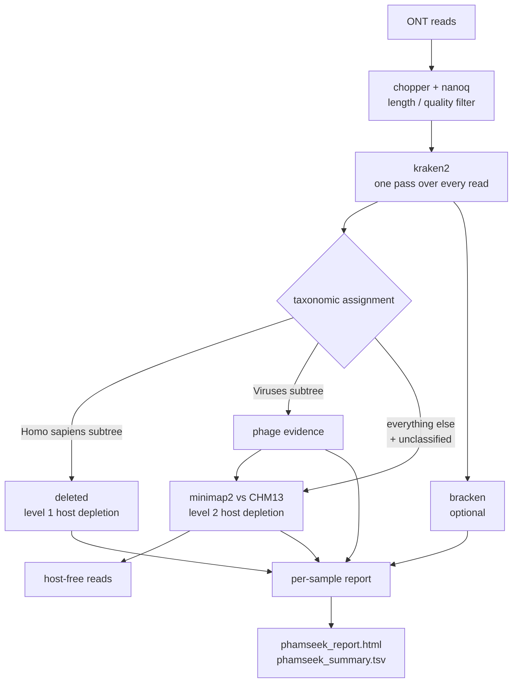

# phamseek

Phage detection in low-biomass clinical Oxford Nanopore metagenomes.

phamseek takes basecalled ONT reads from plasma or CSF, removes human sequence in two
independent passes, classifies what remains against a phage reference database, and
produces one HTML report and one TSV per run.

> **NOT FOR CLINICAL DIAGNOSIS.** v0.1 reports read-level k-mer evidence only. Every
> positive is a *candidate* that needs orthogonal confirmation.

---

## Quick start

```bash
bin/phamseek install                       # one-time, no root needed
bin/phamseek doctor                        # verify tools and databases

bin/phamseek run \
    --input samplesheet.csv \
    --db_dir /path/to/phamseek_db \
    --outdir results
```

The report lands at `results/summary/phamseek_report.html`. Full option list:
`bin/phamseek run --help`.

You do not need to know that phamseek is a Nextflow pipeline underneath, and you should
not need to invoke `nextflow` yourself.

### Samplesheet

```csv
sample_id,fastq,platform,sample_type
plasma_01,reads/plasma_01.fastq.gz,ont,sample
csf_02,reads/csf_02.fastq.gz,ont,sample
ntc_01,reads/ntc_01.fastq.gz,ont,ntc
```

`fastq` paths may be absolute, or relative to the samplesheet's own directory.
`platform` and `sample_type` are optional (defaults `ont` and `sample`).

**Include a no-template control whenever you can.** These are low-biomass libraries, where
reagent contamination is a leading cause of low-abundance calls. Given an `ntc` row,
phamseek flags every taxon that also appears in the control and downgrades its call.
It does not subtract control counts — see [docs/output.md](docs/output.md).

---

## What it does



**kraken2 runs before host depletion on purpose.** One pass classifies every read, and
that single pass yields both the taxonomic profile and a free first pass of host removal:
where the database carries human decoy sequences, roughly 99.6% of human reads land in
taxid 9606 in under a second, leaving the aligner a fraction of the work.

**Two levels, because one is not enough.** A kraken2 decoy only changes a read's *label*;
it does not delete anything. Reads the database fails to recognize would still reach the
published output. Level 2 aligns everything level 1 kept against T2T-CHM13v2 and keeps
only reads with no alignment at all, so a read touching the host reference is deleted
rather than relabeled. Both levels write their removal counts into the report.

The two levels are genuinely redundant, and that is verifiable: with a decoy database,
level 1 removes 100% of host reads and level 2 finds nothing left; with a non-decoy
database, level 1 removes 0% and level 2 removes 100%. Both routes land on the same
answer.

---

## What it deliberately does not do

| Not in v0.1 | Why |
|---|---|
| Assembly, geNomad, CheckV (`--mode full`) | Target samples are low-biomass plasma and CSF where coverage rarely supports assembly. The validated route is kraken2 lead detection followed by targeted mapping. `--mode full` fails with an explanation rather than running a partial path. |
| Illumina / paired-end input | The QC step, the minimap2 preset, and the single-end kraken2 call are all long-read specific. Illumina data would produce numbers that look valid and are not. |
| Chimeric read splitting | ONT cDNA libraries produce concatemers. v0.1 *measures* the resulting signal and reports it; it does not split reads. |
| NTC subtraction | Choosing a subtraction rule needs replicate controls this pilot does not have. phamseek flags instead. |
| Limit-of-detection calibration | Needs a dilution series on the real assay. |

---

## Reference databases

Databases are always external to this repository and are never copied into the work
directory. `--db_dir` expects:

```
<db_dir>/kraken2/    kraken2 database (hash.k2d, opts.k2d, taxo.k2d)
<db_dir>/host/       host reference for level 2 (.mmi, or FASTA)
```

Choosing the kraken2 database is the single most consequential decision, and it is a
question of **coverage of the target niche**, not of size or speed. Classification time
differs by only ~14% between a 0.9 GB and an 11 GB database, while detection of novel
sequence differs by a factor of 65. The only real constraint is RAM, which must exceed
the database size — kraken2 loads it whole.

A database built with non-phage **decoy** sequences (bacteria, plasmid, human) is strongly
preferred. It suppresses plasmid false positives from 37.4% to at or below 0.4%, and it is
what makes level-1 host depletion work. Declare it with `--db_has_decoy` so the report
words its caveats correctly.

The `.mmi` host index must be built with the same minimap2 preset used at mapping time
(`map-ont`); minimap2 silently honors the index's parameters over the command line.

---

## Interpreting the results

Read [docs/output.md](docs/output.md) before reading a report. The four boundary conditions
that most often get lost:

- **A negative result does not exclude a phage.** Recall depends on the reference database
  containing a close (>=80% ANI) neighbor: ~96% when one exists, ~50% when none does.
- **Plasmids and ICE/IME are the dominant false-positive source**, and raising
  `--kraken2_confidence` does not fix it. The signal is real shared homology (integrase,
  relaxase modules), not stray k-mers. Decoy sequences in the database are the fix.
- **RPM is normalized to non-host reads**, which is right for human-dominated samples but
  inflates without bound when few non-host reads remain. Always read RPM next to
  `nonhost_denominator`.
- **Read counts are not independent molecules.** These libraries are pre-amplified.

The methodological basis is a benchmark of kraken2-based in-silico phage detection; the
figures above come from it.

---

## Documentation

- [docs/usage.md](docs/usage.md) — every option, samplesheet rules, worked examples
- [docs/output.md](docs/output.md) — output layout, every column, how to read a call
- [deploy/INSTALL.md](deploy/INSTALL.md) — installation, including offline hosts

## Requirements

- Linux, x86-64 or arm64
- [pixi](https://pixi.sh) (a single static binary; no root, and it does not touch an
  existing conda installation)
- RAM greater than the kraken2 database size (~12 GB for the 11 GB database)
- No network access at run time, once the environment and the Nextflow plugins are cached

## Development

```bash
nextflow run . -profile test,no_pixi -stub --outdir /tmp/phamseek_stub   # wiring only
nextflow run . -profile test --db_dir <db> --outdir /tmp/phamseek_test   # tiny real run
```

`test/` ships ~1.2 MB of simulated ONT reads. They come from a deliberately simplified
simulator ([test/make_test_data.py](test/make_test_data.py)) and exercise wiring and
detection of a near-neighbor phage. They are not a performance benchmark.

## License

MIT — see [LICENSE](LICENSE).
