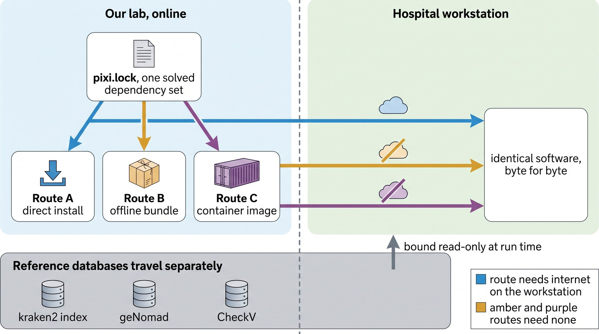
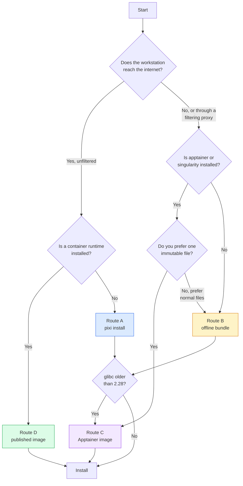

# Installing phamseek

phamseek finds bacteriophage sequences in clinical metagenomes. It reads Oxford Nanopore
FASTQ, removes human reads with minimap2, and profiles what remains against a curated
phage reference database with kraken2. Assembly, and cross-checking the calls against
assembled viral contigs with geNomad and CheckV, are planned but not implemented — so
this version needs only two reference databases, not four.

This guide is for the person installing it on the workstation. It assumes you can use a
terminal and nothing else. **You do not need root, and you do not need to touch your
existing conda installation.**

---

## Before anything else: it does not disturb your current pipeline

phamseek is a **parallel phage layer**, not a replacement for your Kraken2 PlusPF
lead-detection workflow.

- It installs into **one directory you choose** and writes nowhere else. Uninstalling is
  `rm -rf` on that directory.
- It **does not use conda**. It brings its own tools in its own prefix and only puts them
  on `PATH` inside a shell where you explicitly activate it.
- It **does not read, modify, or reindex your PlusPF database**. It uses its own database
  directory, mounted read-only.
- It **does not run automatically** and has no service, daemon, or cron entry.

Both pipelines can live on the same machine and run on the same samples. Section
[Running phamseek alongside Kraken2 PlusPF](#running-phamseek-alongside-kraken2-plus-pf)
explains how to combine the two sets of results, and why merging the two kraken2
databases is not the way to do it.

---

## The delivery in one picture



*One solved dependency set ([pixi.lock](../pixi.lock)) produces every install route,
so whichever route you take you get the same software down to the byte — the published
container image ([docker/Dockerfile](../docker/Dockerfile)) installs that same lock.
Reference databases are deliberately outside all of them: they are large, they version on their own
schedule, and keeping them separate means a database update never requires reinstalling
the pipeline.* **Note on the database row: phamseek needs only the kraken2 index and a
human index. The geNomad and CheckV databases shown there are reserved for the assembly
tier — you do not need to obtain or install them now.**

---

## Which route should I take?

Run the preflight check first. It tells you the answer and everything else you need to
know about the machine.

```bash
# From the delivered files, no installation required — it only reads.
./deploy/preflight.sh --db-dir /path/to/your/databases
```

It prints a colored report, writes `preflight.json` next to it, and exits `0` (all
good), `1` (usable, read the warnings) or `2` (something must be fixed first). The last
section of its output names the route to follow.

If you want to decide by hand:



A partially filtered network is worse than no network: the install starts, then stalls
halfway through a download. **If the preflight reports anything other than all four
sources reachable, treat the machine as offline and use route B or C.**

| | Route D · published image | Route A · pixi install | Route B · offline bundle | Route C · Apptainer image |
|---|---|---|---|---|
| Needs internet on the workstation | yes (once) | yes | no | no |
| What we send you | nothing | nothing | one 1.2 GB archive | one 1.5 GB `.img` file |
| Depends on the host glibc | **no** | yes (≥ 2.28) | yes (≥ 2.28) | **no** |
| Needs a container runtime | yes | no | no | yes |
| Disk used | ~1.6 GB | ~5 GB | ~5 GB | ~1.5 GB |
| Easiest to update | **yes** | yes | medium | medium |

Routes C and D are both Apptainer images and are easy to confuse. Route **C** is a
self-contained `.img` that carries the pipeline source, Nextflow and the pre-fetched
Nextflow plugins, and is run directly (`apptainer run phamseek.img --input ...`). It
exists for machines that will never see the internet. Route **D** carries tools only;
Nextflow runs on the host, fetches the pipeline itself, and pulls the image on first use.

---

## Route D — the published container image

Best when the workstation reaches the internet and has Apptainer, Docker, Podman or
Singularity. Nothing is installed except Nextflow: the image is pulled on first use and
cached.

### Prerequisites

- Linux, x86_64 or aarch64 (the image is built natively for both)
- Nextflow ≥ 25.10.0
- Apptainer, Singularity, Docker or Podman
- ~1.6 GB free disk for the cached image
- No root, unless your container runtime requires it

### Commands

```bash
# 1. Install Nextflow (a single self-installing launcher, no root).
curl -s https://get.nextflow.io | bash
sudo mv nextflow /usr/local/bin/     # or keep it in ~/bin and add that to PATH

# 2. Get the reference databases. ~8.5 GB down, ~16 GB on disk; resumable,
#    checksummed, and idempotent if you have to re-run it.
nextflow run rujinlong/nf-phamseek --mode setup --db_dir /data/phamseek_db

# 3. Confirm the pipeline, the image and the databases all resolve, on the
#    bundled test data. This pulls ~1.6 GB once.
nextflow run rujinlong/nf-phamseek -profile test,apptainer \
    --db_dir /data/phamseek_db --outdir /tmp/phamseek_test
```

`-profile apptainer` is the default and may be omitted; `-profile docker`, `-profile
podman` and `-profile singularity` select the other engines. Every one of them uses the
same image, `docker.io/jinlongru/nf-phamseek`, at the tag matching the pipeline version.

### Where the image is cached

Set `NXF_APPTAINER_CACHEDIR` (or `NXF_SINGULARITY_CACHEDIR`) to a directory on a disk
with room, and to a **shared** one if several people on the machine will run the
pipeline — otherwise each of them converts and stores their own 1.6 GB copy:

```bash
export NXF_APPTAINER_CACHEDIR=/data/containers
```

### Common failures

| What you see | Why | Fix |
|---|---|---|
| `Failed to pull singularity image` | no network, or a registry-filtering proxy | Switch to route B or C. |
| `command not found` inside a task | a host `PATH` leaked in and shadowed the image | Do not set `apptainer.runOptions` to include `--writable-tmpfs` plus a host bind over `/opt`. |
| Results owned by `root` (Docker only) | the `-u` run option was overridden | `-profile docker` sets `-u $(id -u):$(id -g)`; a site config that replaces `docker.runOptions` drops it. |

### Updating

```bash
nextflow pull rujinlong/nf-phamseek        # new pipeline revision
```

The image tag is pinned in `nextflow.config` and moves with the pipeline version, so a
pipeline update brings its matching image with it. Nothing has to be updated by hand.

---

## Route A — `pixi install`

Best when the workstation reaches conda-forge and bioconda directly.

### Prerequisites

- Linux, x86_64 or aarch64, glibc ≥ 2.28 (RHEL 8, Ubuntu 20.04, Debian 10 and anything
  newer are fine)
- ~5 GB free disk
- No root

### Commands

```bash
# 1. Install pixi. One static binary into ~/.pixi/bin, nothing else touched.
curl -fsSL https://pixi.sh/install.sh | bash
export PATH="$HOME/.pixi/bin:$PATH"

# 2. Unpack the pipeline source we sent you, then materialize the environment.
cd /path/to/phamseek
pixi install --frozen        # --frozen = use pixi.lock exactly, never re-solve

# 3. Confirm
pixi run nextflow -version
```

### Expected output

```
The default environment has been installed.
```

followed by the Nextflow banner and a version number. `pixi install` prints a progress
bar for roughly 290 packages and takes 3–10 minutes on a first run.

### Common failures

| What you see | Why | Fix |
|---|---|---|
| `failed to solve the environment` | pixi ignored the lock file and tried to re-resolve | You dropped `--frozen`. Add it back. The lock file is the whole point. |
| Downloads stall at 60–90 % | a filtering proxy allows the metadata request and blocks the package files | Stop. Switch to route B. |
| `PKIX path building failed` from Nextflow later | your proxy re-signs TLS with a private CA that Java does not trust, while curl does | Ask IT for the CA certificate and import it into the JDK, or switch to route B and avoid the network entirely. |
| `GLIBC_2.28 not found` | the workstation's glibc is older than the packages need | Route C. The container carries its own glibc. |

---

## Route B — offline bundle

Best when the workstation has no usable internet. Nothing in this route touches the
network, on either machine, after the archive has been copied across.

### Prerequisites

- Linux, matching architecture, glibc ≥ 2.28
- ~5 GB free disk plus ~1.2 GB for the archive
- The `ca-certificates` package installed. This is not optional even though the install
  is offline: the unpacker builds an HTTPS client at start-up and aborts without a
  system trust store. The preflight checks for it.
- No root

### Commands

```bash
# 1. Verify the archive against the checksum we sent you by a different channel.
sha256sum -c phamseek-offline-v0.2.0-linux-64.tar.zst.sha256

# 2. Unpack and install. The argument is where phamseek will live.
tar -xf phamseek-offline-v0.2.0-linux-64.tar.zst
cd phamseek-offline-v0.2.0-linux-64
./install.sh ~/phamseek

# 3. Confirm
source ~/phamseek/activate.sh
nextflow -version
kraken2 --version
```

### Expected output

```
==> Unpacking the conda environment (a few minutes; it is decompressing ~2 GiB)
💫 Finished unpacking to /home/you/phamseek.
==> Installing the pipeline source
==> Installing the pre-fetched Nextflow plugins
==> Writing /home/you/phamseek/activate.sh

Installed.
```

Then, after sourcing:

```
phamseek environment active.
  pipeline : /home/you/phamseek/pipeline
  nextflow : /home/you/phamseek/env/bin/nextflow
  NXF_HOME : /home/you/phamseek/nxf-home (offline mode)
```

### What the installer refuses to do, and why

It stops before writing anything if `CONDA_PREFIX`, `PYTHONPATH`, `PYTHONHOME`,
`LD_LIBRARY_PATH` or `LD_PRELOAD` is set. Those variables leak from an active conda
environment into every process phamseek starts, and the resulting failure is a linker
error many steps away from the cause. Run `conda deactivate` (sometimes twice) and try
again. The message tells you exactly which variables to clear.

### Common failures

| What you see | Why | Fix |
|---|---|---|
| `No CA certificates were loaded from the system` | no system trust store | `sudo apt-get install ca-certificates`, or set `SSL_CERT_FILE` to an existing bundle |
| `These variables are set and will corrupt the installation` | an active conda environment | `conda deactivate`, then `unset` the listed variables |
| `expected .../env after unpacking` | the bundle was built for the other CPU architecture | Ask us for the `linux-64` bundle (or `linux-aarch64`) |
| `target already exists` | a previous install is in the way | Remove it or choose another path. The installer never overwrites. |
| Nextflow reports it cannot download a plugin | `NXF_HOME` is not pointing at the shipped plugins | Use `source ~/phamseek/activate.sh`, not a hand-built `PATH` |

---

## Route C — Apptainer image

Best when the workstation has an old glibc, or when policy prefers a single immutable
artifact that can be checksummed and archived.

### Prerequisites

- Apptainer or Singularity installed (`apptainer --version`)
- ~1.5 GB free disk
- No root

### Commands

```bash
# 1. Verify the image
sha256sum -c phamseek-0.2.0-x86_64.img.sha256

# 2. Smoke test — no databases needed
apptainer exec --cleanenv phamseek-0.2.0-x86_64.img kraken2 --version
apptainer exec --cleanenv phamseek-0.2.0-x86_64.img nextflow -version

# 3. Run, with your data and databases bound in
apptainer run --cleanenv \
  -B /data/run01:/work \
  -B /data/databases:/db:ro \
  phamseek-0.2.0-x86_64.img \
    --input /work/samplesheet.csv \
    --outdir /work/results \
    --db_dir /db
```

### The bind-mount contract

Three directories exist inside the image and are meant to be bound over:

| Inside | Mode | What goes there |
|---|---|---|
| `/work` | read-write | your FASTQ, the samplesheet, results, and the Nextflow work directory |
| `/db` | **read-only** | the reference databases |
| `/cache` | read-write | optional scratch |

Databases are never inside the image. Binding them read-only is deliberate: nothing
phamseek does should ever be able to modify a reference database.

Always pass `--cleanenv`. Without it the host's `CONDA_PREFIX`, `PYTHONPATH` and
`LD_LIBRARY_PATH` are visible inside the container and can shadow the container's own
libraries — the same class of failure route B guards against at install time.

### Common failures

| What you see | Why | Fix |
|---|---|---|
| `FATAL: while retrieving image` | Apptainer is trying to pull from a registry | Use the local `.img` path, not a `docker://` URI |
| `Read-only file system` writing to `/work` | `/work` was not bound, so the container's own read-only copy is being used | Add `-B /your/dir:/work` |
| `No such file or directory` for the database | the bind path and `--db_dir` disagree | They must match: `-B /data/databases:/db:ro` goes with `--db_dir /db` |
| Tools behave oddly, imports fail | host environment leaked in | Add `--cleanenv` |

---

## Reference databases

Databases are shipped separately from the software, as split, checksummed packages.

### What phamseek needs

**Two things, and nothing else:**

| What | Size | Why |
|---|---|---|
| a kraken2 phage index | 7.7 GB (`inphared_decoy`) | the classification itself |
| a human minimap2 index | ~4 GB (CHM13v2 `.mmi`) | host depletion before classification |

geNomad and CheckV are **not used**. They belong to the assembly tier, which is not
implemented.
If you have seen them mentioned elsewhere, or in the architecture figure above, you can
ignore them for now — there is nothing to download and nothing to configure.

### Directory layout

`--db_dir` points at a root directory holding one subdirectory per database:

```
/data/databases/
├── kraken2/
│   └── inphared_decoy/     hash.k2d, opts.k2d, taxo.k2d      (required)
├── host/
│   └── chm13v2.mmi         human minimap2 index              (required)
├── genomad_db/             reserved for v0.2 — leave absent
└── checkv/                 reserved for v0.2 — leave absent
```

[preflight.sh](preflight.sh) understands this layout, and reports missing `genomad_db/`
and `checkv/` as informational rather than as problems.

If you have no human index, you can run with `--skip_host_removal true`. Human reads
then reach the classifier, which costs time and adds a small false-positive load.

### Choice of kraken2 database

| Database | Size | Role |
|---|---|---|
| `inphared_decoy` | 7.7 GB | **Recommended for production.** Cultured phage genomes from INPHARED plus bacterial, plasmid and human decoy sequences. The decoys are what suppress plasmid false positives. |
| `inphared_7Apr2026` | 939 MB | Smoke testing, and a minimal option for a memory-constrained machine. Same phage content, no decoys. |
| `uhgv_heldout_decoy` | 11 GB | Optional. A human **gut** DNA virome catalog. Only worth installing if you later analyze stool samples; it adds little for plasma and CSF. |

`inphared_decoy` is the default because it covers cultured phages of the organisms that
matter in bloodstream and CNS infection — *Staphylococcus*, *Pseudomonas*, *Klebsiella*,
*Escherichia coli*.

Plan for **about 8 GB of RAM** while kraken2 has it loaded. kraken2 holds the whole index
resident, so the requirement is roughly the database size plus a few GB of headroom; the
11 GB `uhgv_heldout_decoy` was measured at 10.8 GB peak RSS, which is where the 1:1
estimate comes from. The preflight computes this against your actual database and tells
you whether the machine fits.

### Receiving a database package

```bash
# 1. Copy the package directory across, resumably
rsync -av --partial --append-verify \
      <sender>:/path/to/inphared_decoy_20260807/ ./inphared_decoy_20260807/

# 2. Verify and install in one step
./inphared_decoy_20260807/db_verify.sh \
    --package-dir ./inphared_decoy_20260807 \
    --dest /data/databases
```

`rsync` needs SSH access. Over SFTP or Nextcloud, download the directory with your usual
client and then run step 2 unchanged — the verification does not care how the bytes
arrived.

### What verification actually proves

[db_verify.sh](db_verify.sh) runs four gates, and each one catches something the previous
one cannot:

1. **Volumes** — every `.part-NNN` matches its recorded SHA-256, and the numbering is
   contiguous with no gaps.
2. **Archive** — the volumes concatenate into the exact recorded stream and it
   decompresses. This is what catches volumes that are individually intact but
   reassembled in the wrong order.
3. **Contents** — every extracted file matches the manifest, **and there are no extra
   files** the manifest does not describe. Before extracting, the archive's member list
   is inspected and rejected if it contains absolute paths, `..` traversal, symlinks or
   device nodes.
4. **Behavior** — kraken2 classifies a fixed 12-sequence input and must produce exactly
   the taxids we recorded on our machine. Checksums prove the bytes arrived; only this
   gate proves the database *works the same way here*, and it is the one that catches
   pointing `--db` at the wrong directory level.

Expected output ends with:

```
  [PASS] volumes: 3/3 intact
  [PASS] volumes: numbering is contiguous 000..002
  [PASS] archive: reassembles to the recorded SHA-256
  [PASS] archive: decompresses cleanly
  [PASS] contents: 19/19 files match the manifest
  [PASS] contents: no unexpected extra files
  [PASS] behaviour: every sequence got the taxid we recorded (3 within Viruses/10239)

All gates passed.
```

Gate 4 is skipped with a warning if kraken2 is not on `PATH`. Run the verification again
after activating phamseek to complete it.

The checksums are sent to you over a **different channel** than the data. Compare the
`SHA256SUMS.volumes` you received by email against the one in the package before
trusting either. If we signed the package, verify the signature too:

```bash
gpg --verify MANIFEST.tsv.asc MANIFEST.tsv
gpg --verify SHA256SUMS.volumes.asc SHA256SUMS.volumes
```

Checksums prove the data did not change in transit. Only the signature proves it came
from us.

---

## Running phamseek alongside Kraken2 Plus PF

Your existing workflow uses Kraken2 PlusPF for lead detection, followed by mapping and
BLAST confirmation. phamseek does not change any of that. Run both on the same reads and
join the outputs on read ID or on taxon.

**Do not try to merge our phage database into your PlusPF database.** Two *built* kraken2
databases cannot be combined. `hash.k2d` is a compact minimizer hash table built against
one specific taxonomy and one specific k-mer space; concatenating two of them produces a
file that is structurally valid and semantically meaningless. There is no
`kraken2-merge`, and nothing will warn you.

The only correct way to get a single combined database is:

1. Obtain the original FASTA libraries behind **both** databases.
2. Reconcile them onto a single NCBI taxonomy snapshot, resolving every taxid collision.
3. Rebuild from scratch with `kraken2-build`.

That is days of work, produces a database neither of us has validated, and invalidates
your existing PlusPF results because the classification changes when the reference set
changes. Treat it as an expert-level fallback, not a starting point.

**Run the two databases in parallel and combine the results instead.** It is simpler, it
leaves your validated PlusPF workflow untouched, and it is what we recommend:

```bash
# Your existing pipeline, unchanged
kraken2 --db /data/databases/pluspf --report pluspf.report reads.fastq

# phamseek, on the same reads
nextflow run rujinlong/nf-phamseek -profile apptainer \
    --input samplesheet.csv --outdir results --db_dir /data/databases
```

The two reports are joined on taxid. Where PlusPF says "unclassified" and phamseek names
a phage, that is exactly the signal phamseek exists to add.

### Do not raise `--confidence`

phamseek's default is **`--confidence 0.02`**, and on Nanopore data that is the right
value. Leave it alone unless you have a measured reason.

The widely quoted kraken2 setting of `0.10` comes from short-read practice. On ONT reads
it costs **15–29 percentage points of sensitivity** — the higher error rate means fewer
of a read's k-mers match the reference, so a threshold expressed as a fraction of
matching k-mers rejects true positives that a short read would have kept. Going the other
way, kraken2's own default of `0` calls a taxon on a single k-mer hit and produces a
large false-positive load.

If you need to change it, change it in one place (`--kraken2_confidence`) and re-run the
whole cohort. A mixed cohort where some samples were classified at 0.02 and others at
0.10 is not comparable.

### How to read the phage calls

Two things must be stated whenever a number from phamseek is quoted:

- **Sensitivity depends on how close a relative is in the reference database.** For
  sequences with a close neighbor in the reference, detection is high. For sequences with
  no close relative it drops sharply. A negative result means "no close relative in this
  database", not "no phage".
- **Precision depends on sample composition, not on the classifier.** The decoy sequences
  in `inphared_decoy` are what suppress plasmid and mobile-element false positives; with a
  decoy-free database the plasmid false-positive rate is much higher.

The benchmark behind these statements, with the numbers, is in the
[methodology repository](https://github.com/rujinlong/p0126-kraken2phage).

---

## Running phamseek

### The samplesheet

Oxford Nanopore data is single-end. One row per sample:

```csv
sample_id,fastq,platform,sample_type
PAT001,/data/run01/PAT001.fastq.gz,ont,sample
PAT002,/data/run01/PAT002.fastq.gz,ont,sample
NTC01,/data/run01/NTC01.fastq.gz,ont,ntc
```

`sample_type` is one of `sample`, `ntc` or `positive_control` — it selects how the report
treats the row, not what the material was, so plasma and CSF are both `sample`. Anything
else is rejected before the run starts. The authoritative column list is
[nextflow_schema.json](../nextflow_schema.json); `docs/usage.md` explains each column.

Include a no-template control (`ntc`) whenever one exists. These libraries are low enough
biomass that reagent contamination is the dominant source of low-abundance positives, and
without a control there is nothing to compare a weak positive against.

On an offline machine all paths must be local absolute paths: a `http:`, `ftp:` or `s3:`
URI cannot be staged.

### The run

Routes A and D run the pipeline the ordinary Nextflow way:

```bash
nextflow run rujinlong/nf-phamseek \
    -profile apptainer \
    --input /data/run01/samplesheet.csv \
    --outdir /data/run01/results \
    --db_dir /data/databases
```

Use `-profile pixi` instead of `-profile apptainer` if you took route A and have no
container runtime.

Route B ships a wrapper that activates the bundled environment first:

```bash
source ~/phamseek/activate.sh
phamseek --input /data/run01/samplesheet.csv \
         --outdir /data/run01/results \
         --db_dir /data/databases
```

The `phamseek` wrapper layers [offline.config](offline.config) over the pipeline
configuration. That file switches off every Nextflow feature that would otherwise reach
the network at run time — conda environment creation, container pulls, Wave, Fusion,
Seqera Platform reporting, and remote executors. None of them are used by phamseek, but
any of them can be switched on accidentally by a stray environment variable or a
leftover `~/.nextflow/config`, and the resulting error names a registry or a scheduler
rather than the network.

If you invoke `nextflow` directly instead of the wrapper, pass it yourself:

```bash
nextflow -c ~/phamseek/pipeline/deploy/offline.config \
         run ~/phamseek/pipeline/main.nf --input ... --outdir ... --db_dir ...
```

Always give the pipeline as an **absolute local path**. `nextflow run rujinlong/nf-phamseek`
makes Nextflow resolve the name through GitHub, which cannot work offline.

---

## Behind a proxy

Route A only. Nextflow runs on the JVM, which ignores `http_proxy` and `https_proxy` —
they must be restated as JVM properties:

```bash
export http_proxy=http://proxy.example.org:8080
export https_proxy=$http_proxy
export NXF_OPTS="-Dhttp.proxyHost=proxy.example.org -Dhttp.proxyPort=8080 \
                 -Dhttps.proxyHost=proxy.example.org -Dhttps.proxyPort=8080"
```

If the proxy inspects TLS, Java will additionally reject its certificate with
`PKIX path building failed` even when curl accepts it, because the two use different
trust stores. Import the proxy's CA into the JDK, or use route B and stop fighting it.

---

## Uninstalling

```bash
rm -rf ~/phamseek           # routes A and B
rm -f phamseek-0.2.0-*.img  # route C
```

Databases live wherever you put them and are removed separately. Nothing was installed
outside these paths, and no system file was modified.

---

## Getting help

Send us three things and we can almost always diagnose without access to your machine:

1. `preflight.json` from [preflight.sh](preflight.sh)
2. `.nextflow.log` from the run directory
3. The exact command you ran

**Do not send patient reads, per-read classification output, or any file containing
sample identifiers.** The preflight report and the Nextflow log contain no patient data
by design. If a log excerpt would contain a sample name, replace it before sending.

---

## For maintainers

Building the artifacts, and what to run on deployment day, is documented in
[MAINTAINERS.md](MAINTAINERS.md).
